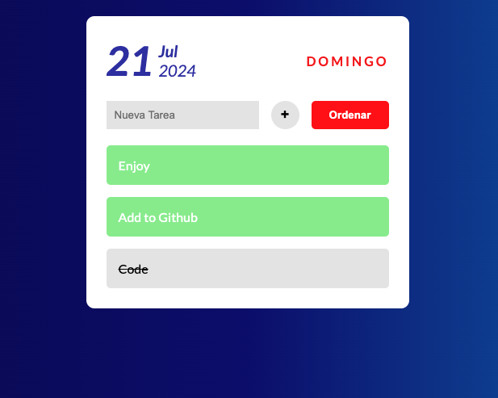

# Daily Task Manager

This web application helps you stay organized by managing your daily tasks in a simple and effective way.

## Features

- **Automatic Date Display:** The current date is displayed in Spanish format (día, mes, año) to provide context for your tasks.
- **Task Creation:** Add new tasks directly through the provided input field.
- **Task Completion:** Mark tasks as completed by clicking on them. Completed tasks are visually distinguished for clarity.
- **Task Reordering:** Tasks can be automatically reordered to prioritize unfinished tasks. This ensures you focus on what needs your attention first.

## Screenshot

## How to Use

1. Clone or download the repository.
2. Open the `index.html` file in your web browser.
3. Start adding your daily tasks! Click on a task to mark it as completed.

## Technologies Used

- HTML
- CSS
- JavaScript

## Additional Notes

- Feel free to customize the application's appearance and functionality to suit your preferences.
- This is a basic example, and you can extend it to include features like task deadlines, categories, or persistence (saving tasks across sessions).

## License

MIT License

